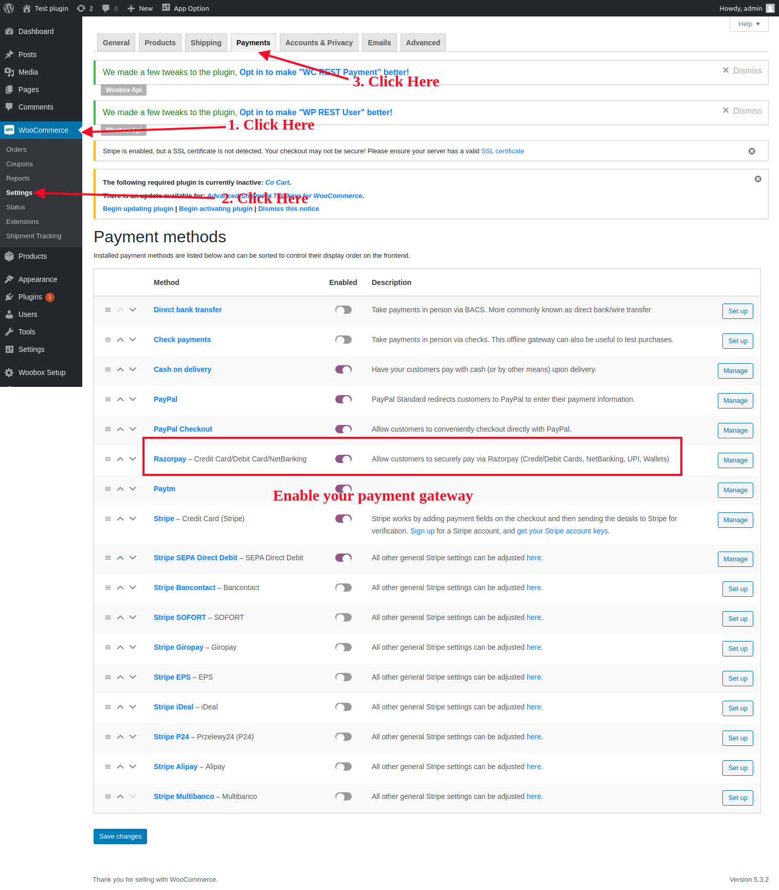

USER GUIDE
==========

This documentation file covers all the information needed to install and use this Template. You'll find everything you need to know to create a stunning and beautiful admin panel website in minutes.

-   Created: 25 Jun 2020
-   By: Vaibhav's Development
-   Email: [vaibhav.hariramani01@gmail.com](mailto:vaibhav.hariramani01@gmail.com)
-   HelpDesk: [https://vaibhavhariaramani.github.io/](https://vaibhavhariaramani.github.io/projects/android%20development/Ecommerce%20App/index.html)

Basic Installation
------------------

**Before you start the installation, please make sure you have the following components enable on your server**

`                                 `

-   Xampp / Lampp / Wampp
-   PHP 7.2.14 or greater
-   OpenSSL PHP Extension
-   PDO PHP Extension
-   Mbstring PHP Extension
-   Tokenizer PHP Extension
-   XML PHP Extension
-   Ctype PHP Extension
-   JSON PHP Extension
-   GD PHP Extension
-   Imagick PHP Extension
-   PHP Fileinfo extension
-   PHP Zip Archive
-   Rewrite Module (Apache or Nginx)

Installation Instructions
-------------------------

##### How to Install WordPress

`                                             `

-   Before Start Installation Make Sure All Permissions Have Been Garnted To Your Server Folder
-   For Ubuntu user sudo chmod -R 777 var/www/yourfolder

-   Download the WordPress package to your local computer from [http://WordPress.org/download/](http://WordPress.org/download/)
-   Create a database for WordPress on your web server, as well as a MySQL (or MariaDB) user who has all privileges for accessing and modifying it.
-   (Optional) Find and rename wp-config-sample.php to wp-config.php, then edit the file (see Editing wp-config.php) and add your database information. Note: If you are not comfortable with renaming files, step 3 is optional and you can skip it as the install program will create the wp-config.php file for you.
-   Upload the WordPress files to the desired location on your web server:
    -   If you want to integrate WordPress into the root of your domain (e.g. http://example.com/), move or upload all contents of the unzipped WordPress directory (excluding the WordPress directory itself) into the root directory of your web server.
    -   If you want to have your WordPress installation in its own subdirectory on your website (e.g. http://example.com/blog/), create the blog directory on your server and upload the contents of the unzipped WordPress package to the directory via FTP.
    -   Note: If your FTP client has an option to convert file names to lower case, make sure it’s disabled.
-   Run the WordPress installation script by accessing the URL in a web browser. This should be the URL where you uploaded the WordPress files.
    -   If you installed WordPress in the root directory, you should visit: http://example.com/
    -   If you installed WordPress in its own subdirectory called blog, for example, you should visit: http://example.com/blog/

**After Installing WordPress.Check Api Is Availble Or not.**

``

Open browser And http://yourdomain.com/wp-json

` If You See  Not Found  in Browser Screen`  `                                             Change Permalink Structure Of WordPress                                     ` 

`                                             `

If Above solution Is Not Work Then Follow Below Step.

located in the folder /etc/apache2/apache2.conf
` <Directory /var/www/> Options Indexes FollowSymLinks
AllowOverride None
Require all granted
</Directory> `                                     `

TO

` <Directory /var/www/> Options Indexes FollowSymLinks
AllowOverride All
Require all granted
</Directory>                                         `

How Io Install Plugin
---------------------

Woobox Api
----------

**With Woobox Api , You can easily integrate cart and wishlist functionality to the application.**

This Plugin Is Not Availble On WordPress.org So you Have to Manually Setup This plugin.

This plugin is Availble In documentation/plugins Folder

 `If You See Popup Below Folle Below Instruction`  `                                         `

open wp-config.php

Add

define( 'FS\_METHOD', 'direct' ); below define( 'WP\_DEBUG', false );

Refresh Page And Continue Installation.

`After Install Plugin You Will Be Redirect To This page` 

How To Configure Plugin
-----------------------

   

How To Generate Token
---------------------

**Once installed and activated, go to Users \> Applications and click the [Add New] button.**

` `  `                                         `

-   All Keys Are Dummy Keys Which Are Mention In Documentation.
-   Don't Use Those Keys For Your Application.
-   Please Follow All Steps Carefully To Get Your All Keys

On the “Add Application” page you will fill in some values. “Consumer Name” and “Description” can be whatever you wish. Just put something that makes sense. I’m not sure what the Callback does at this time so I just inserted something like ` “http://localhost”.`

        

JWT Configuration
-----------------

PHP HTTP Authorization Header enable Most of the shared hosting has disabled the HTTP Authorization Header by default. To enable this option you’ll need to edit your ` .htaccess ` file add the following code `                                                     `

-   RewriteCond %{HTTP:Authorization} \^(.\*)
-   RewriteRule \^(.\*) - [E=HTTP\_AUTHORIZATION:%1]
-   SetEnvIf Authorization "(.\*)" HTTP\_AUTHORIZATION=\$1

For More Information Follow Below Link

` https://github.com/Tmeister/wp-api-jwt-auth/issues/1`

Important Links: For WordPress Rest Api - Oauth 1.0a Server documentation `                                                 `

-   [https://www.datafeedr.com/using-oauth-1-0-WordPress-api-custom-endpoints/](https://www.datafeedr.com/using-oauth-1-0-WordPress-api-custom-endpoints/)
-   [https://www.datafeedr.com/using-oauth-1-0-WordPress-api-custom-endpoints/](https://www.datafeedr.com/using-oauth-1-0-WordPress-api-custom-endpoints/)

Add Product Attibute For Filter
-------------------------------

**Add Custom Product Attibute For Product Filter. Don't Misspell Words**

`                                         Add "brand" , "size" , "color" without spelling mistakes                                     `

     

`For more informationhttps://docs.woocommerce.com/document/managing-products/`

Product Visibilty
-----------------

Currency Change
---------------

Payment Gateways
----------------

**Our App Is Compitable With All Major Payment Gateways**

Supported Payment Gateway

`                                 `

-   COD
-   Paypal
-   RazorPay
-   Paytm
-   PayUMoney

**If you have your own payment gateway for your website. Don't worry our app also compitable with your payment gateway. Our api end point handle your payment request.**

Setup Payment Gateways
----------------------

If you have a plugin zip file thene you can upload plugin zip and install your plugin.[Follow the plugin install Steps](#how-to-install-plugin)

If you want to download plugin from WordPress repository. Then Follow the below steps.

Enable Payment Gateway
----------------------

After Install Plugin You Can See Your Plugin.

Enter Key
---------

Visit The Link To Obtain Your Key.[Razor Pay](https://razorpay.com/docs/payment-gateway/dashboard-guide/settings/)

After Finish Editing Click On Save Changes.

Designed and built with love by [Iqonic Design](http://iqonic.design)
