# Vaibhav's E-Commerce App with WordPress Admin panel Complete Documentation

Email: [vaibhav.hariramani01@gmail.com](mailto:vaibhav.hariramani01@gmail.com)
Sample App: [Vaibhav's Ecommerce App](https://github.com/vaibhavhariaramani/Ecommerce-Android-App/raw/master/Ecommerce%20app.apk)

Thank you all for Downloading this Application Source Code. If you have any questions that are beyond the scope of this help file, please send me email [vaibhav.hariramani01@gmail.com](vaibhav.hariramani01@gmail.com). Thanks so much!

## Table of Contents 
1. [Open project in Android studio]
2. [How to change ApplicationID and Package name]
3. [How to change Application menu icon, background and app icon]
4. [How to change Application name] 
5. [How to change app Font]
6. [How to change color] 
7. [How to Change Admob ID] 
8. [How to change server URL] 
9. [How to change Token] 
### **A) Open project in Android studio** - [top](#toc) 
**Step 1:-** Select ‘Import Project’ option and find your **Ecommerce-Android-App*“" Project** 
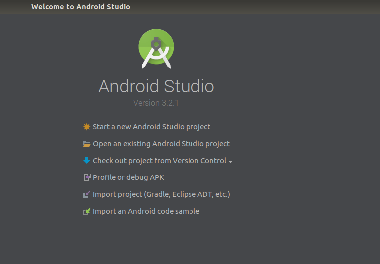 

**Step 2:-** Select your current project then click ok button and wait few minute 

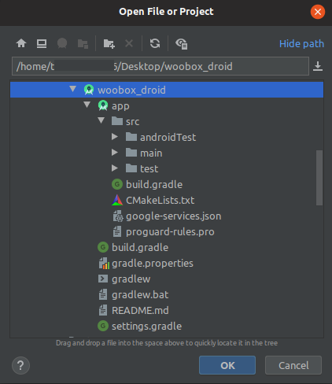 

### **B) How to change ApplicationID and Package name** - [top](#toc) - 
Find build.gradle file inside app folder and click to open and change your **applicationId**
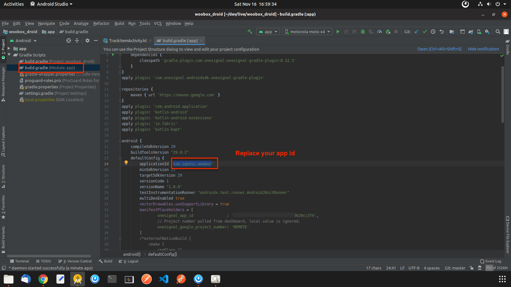 

### **C) How to change Application menu icon, background and app icon** - [top](#toc) -
Open res folder inside open **all drawable folder** and **all mipmap folder** and replace your background images and icons here. 
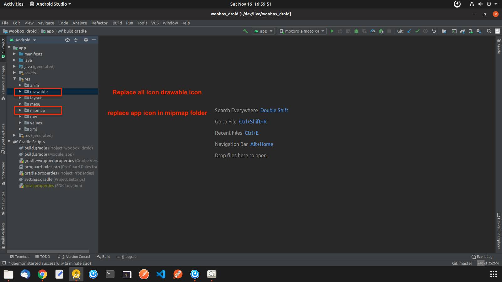 

### **D) How to change Application name** - [top](#toc) - 
Open app gradle file and change your **'app_name'** here 
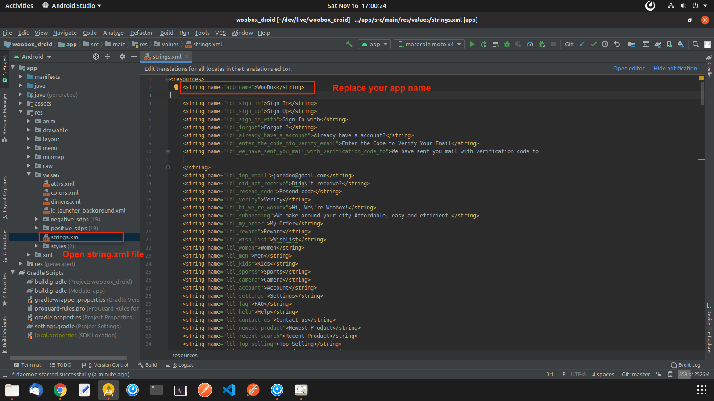 

### **E) How to change app Font** - [top](#toc) - 
Click and open font folder and change ttf file 
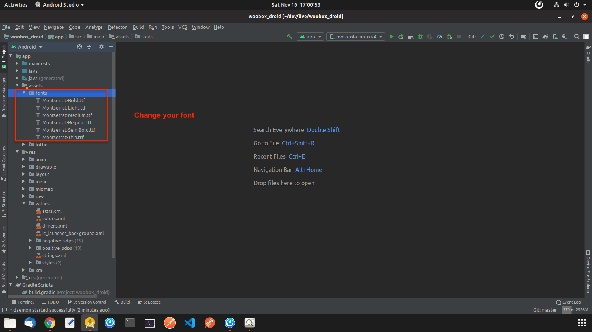 

Open String.xml file and change font string value 
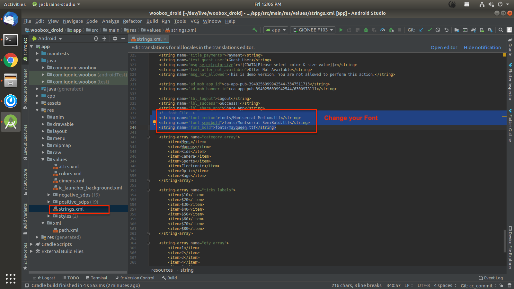 

### **F) How to change app color** - [top](#toc) - 
Open color.xml file and change colors 
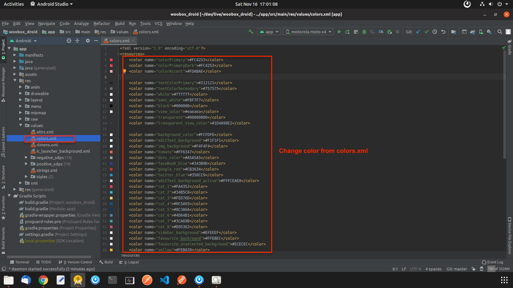 

### **G) How to Change Admob ID** - [top](#toc) - 
Open string.xml file and change admob_app_id and ad_mob_banner_id String value 
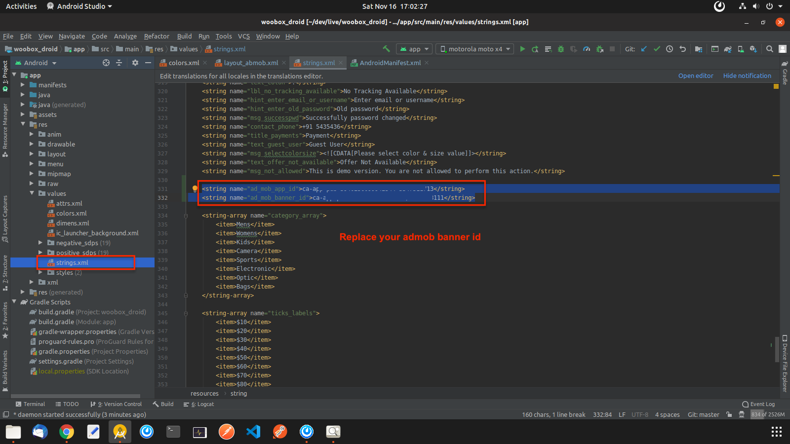 

### **H) How to change server URL** - [top](#toc) - 
Open native-lib.cpp file 
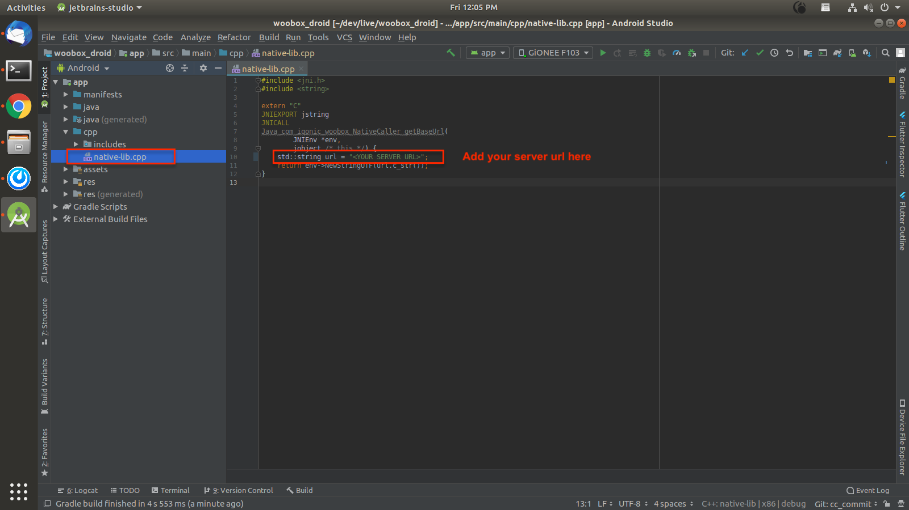 

### **I) How to change Token** - [top](#toc) - 
Open Constants file from utils package and change consumerKey, consumerSecret, token and tokenSecret 
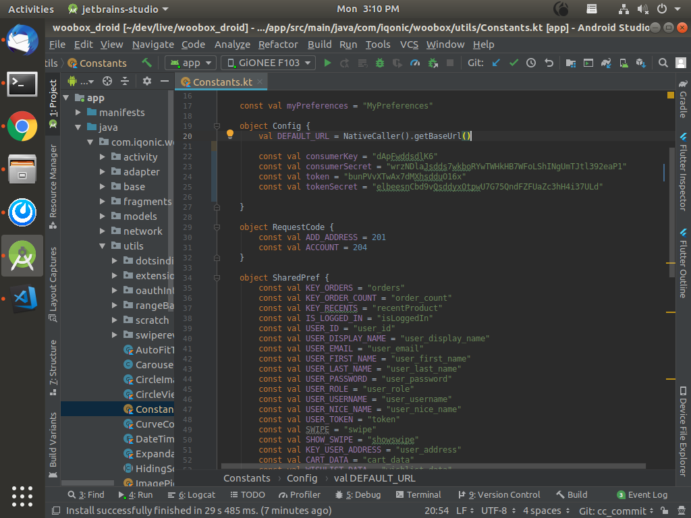 

## THANKS A LOT
Once again, thank you so much for Downloading this **"Vaibhav's E-Commerce App with WordPress Admin panel Source Code"** application. As I said at the beginning, I'd be glad to help you if you have any questions relating to this application. Contact in email [vaibhav.hariramani01@gmail.com](mailto:vaibhav.hariramani01@gmail.com) I'll do my best to assist. 

## Copyright
**GeekyBawa** [Go To Table of Contents](#toc) 
