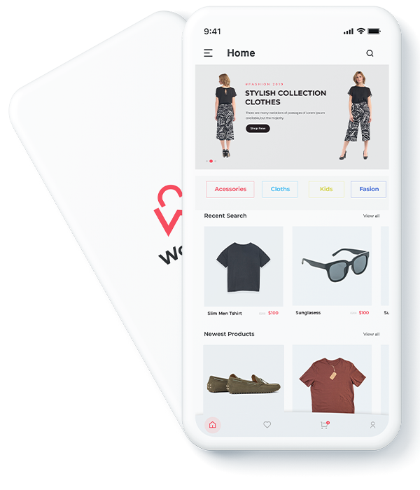
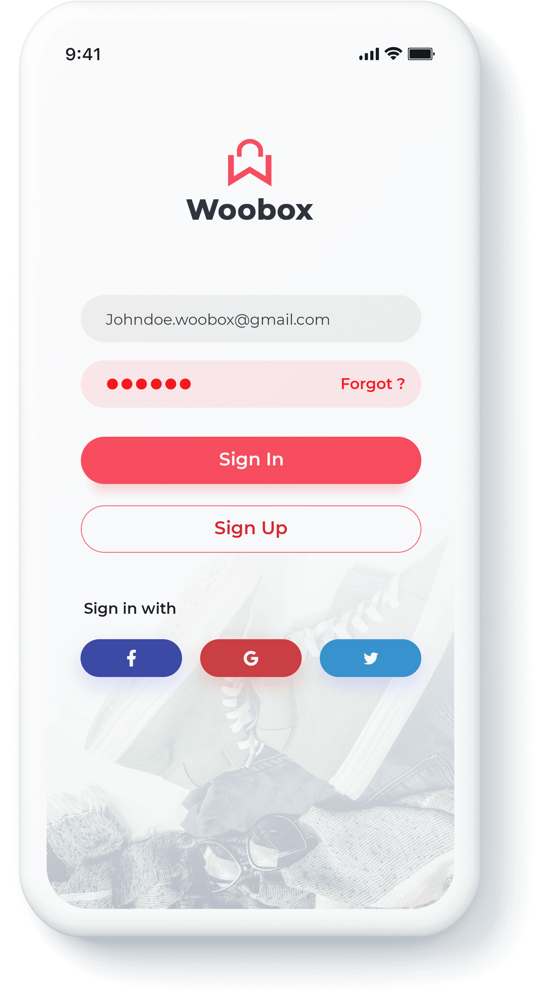
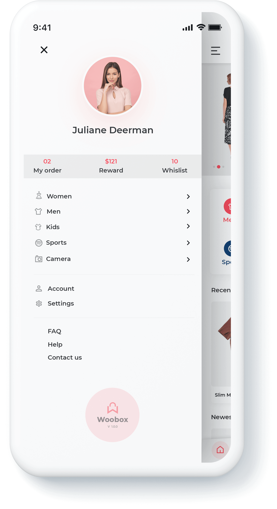
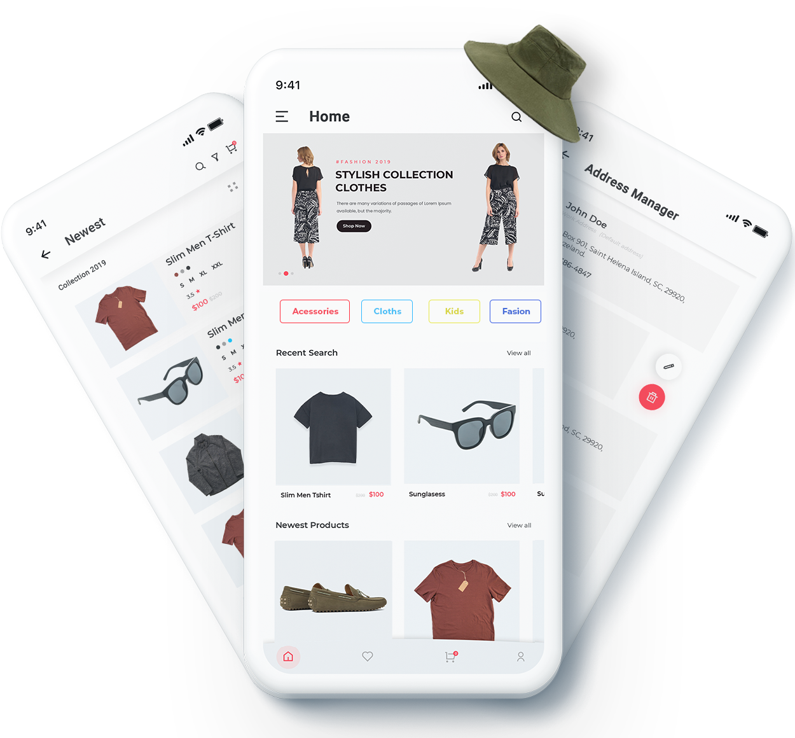

## Our Published App Lauching Website Interface

-   **Home**
-   **Elements**
-   **Features**
-   **Screenshots**
-   **Contact**

+

Checkout our Own
 **Webshop App** **eCommerce App** **Online Store**
===================================================

Vaibhav's Ecommerce App lets you to transform your eCommerce Business into a unique shopping experience on Android tablets and mobile devices It is loaded with components and plugins to help you build the perfect online shopping app for you.

[Download](https://github.com/vaibhavhariaramani/Ecommerce-Android-App/raw/master/Ecommerce%20app.apk)

Build Your Own Ecommerce-Android-App

**

#### 40+ Mind-blowing Screens

Each screen is designed to appeal the modern-day shoppers. Vibrant color tone, ease to navigate and prompt call to action buttons and 40+ fantastic screens.

[Source Code & Intruction to Your own App](https://github.com/vaibhavhariaramani/Ecommerce-Android-App/archive/master.zip)

**

#### Save 500+ Hours

Novice coder? Or non-coder? Well, we worked to build this full ECommerce app to save your 500+ hours of coding and checking.

**

#### Android 10 Support

Ecommerce Shopping App supports the latest release Android 10. There’s a lot new features and you can customize it just the way you want it.

+

**Create Your own Amazing App**
-------------------------------

Grow your business multi-folds by launching an eCommerce app using [Source Code of Ecommerce App.](https://github.com/vaibhavhariaramani/Ecommerce-Android-App/archive/master.zip) It distinguishes itself with plenty of great features like powerful search option, seamless account creation, product and category, smart category filter functions, payment methods, and shipment tracking facility,

This Ecommerce App is an ultimate app for developers or shop owners to build any kind of eCommerce app they need.

+

Standout Features

Our Ecommerce app provides a beautiful collection of eCommerce components to create a whole new mobile shopping experience.

##### Full Applications

Ready-to-build mobile e-commerce app.

**

##### Dynamic Design

Pre-build dynamic design UI screens.

**

##### Payment integration

Smooth payment processing gateway for your app.

**

**

##### little coding required

Create this amazing app with little editing.

**

##### Comprehensive

Guided with detailed documentation.

**

##### Free lifetime updates

We add new features regularly.

App Screenshots

Vaibhav's Ecommerce App offers a variety of high-quality designs, cool features, functionality & 40+ easy-to-customize screens.

Make your own online shopping app in minutes!
---------------------------------------------

Attractive Design
-----------------

Beautifully Build Screens
-------------------------

The powerful set of app screens
-------------------------------

Extremely easy to customize
---------------------------

Download the App

Vaibhav's Ecommerce App will get all your online shopping app requirement covered. With 40+ unique screens and 500+ hours of design and development, Vaibhav's Ecommerce App is structured to give maximum flexibility and customisability.

[**
 Get the app now!](#)

Rate & Review

+

Get in Touch

Thank you for checking us out. You can get in touch with us for any questions, queries, ideas and suggestions.

[Submit Now](#)

-   Mail:vaibhav.hariramani01@gmail.com

-   [**](https://twitter.com/vaibhavhariram2)
-   [**](https://www.facebook.com/jayesh.hariramani.3)
-   [**](https://sites.google.com/view/geeky-traveller/home)
-   [**](https://github.com/vaibhavhariaramani)

style="border:0" allowfullscreen\>

© Copyright 2019 App Developed by [VaibhavHariramani](https://vaibhavhariaramani.github.io/).

[**](#top)
